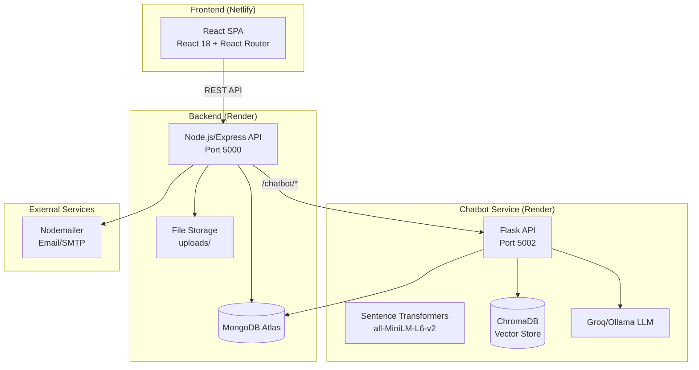
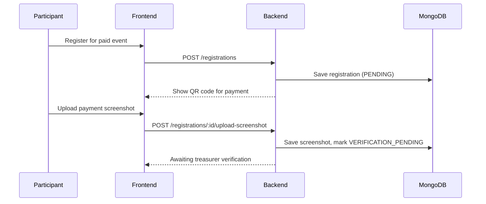

# System Architecture — ACAConnect

## System Overview

ACAConnect is a multi-service application with a React frontend, Node.js/Express backend, and a Python chatbot microservice. All services communicate via REST APIs.

## Architecture Diagram

## Component Descriptions

### Frontend (React SPA)
- **Purpose**: User interface for all roles
- **Responsibilities**: Role-based dashboard routing, event browsing, registration, payment flows
- **Deployment**: Netlify (static build)
- **Key patterns**: Context-based auth, role-based component rendering

### Backend (Node.js/Express)
- **Purpose**: Core API server, business logic orchestration
- **Responsibilities**: Authentication, event CRUD, FSM workflow, requirement distribution, file uploads, notifications
- **Deployment**: Render
- **Database**: MongoDB (Mongoose ODM)
- **Key patterns**: MVC, FSM service, predicate-based routing, role middleware

### Chatbot Service (Flask)
- **Purpose**: RAG-based Q&A assistant for NIRAL
- **Responsibilities**: Intent detection, knowledge retrieval, LLM-powered response generation
- **Deployment**: Render
- **Key patterns**: RAG pipeline (retrieve → augment → generate), hybrid retrieval (JSON + PDF + DB)

## Data Flow

## API Route Map

| Path | Service | Purpose |
|---|---|---|
| `/auth` | Backend | Staff login/auth (JWT) |
| `/participant-auth` | Backend | Participant signup/login |
| `/events` | Backend | Event CRUD + FSM transitions |
| `/registrations` | Backend | Participant event registration |
| `/budgets` | Backend | Budget management |
| `/notifications` | Backend | Role-based notifications |
| `/participant-notifications` | Backend | Participant notifications |
| `/admin` | Backend | Admin operations |
| `/chatbot` | Backend → Chatbot | Proxy to chatbot service |
| `/logistics` | Backend | Expense/procurement management |
| `/hospitality` | Backend | Venue allocation |
| `/hr` | Backend | Volunteer/judge allocation |
| `/techops` | Backend | Attendance management |
| `/certificates` | Backend | Certificate generation |
| `/financial` | Backend | Income/expense analytics |
| `/scheduling` | Backend | Event scheduling + conflicts |
| `/designs` | Backend | Design file uploads |
| `/photos` | Backend | Photo management |
| `/alumni` | Backend | Alumni features |
| `/onsite-registrations` | Backend | Walk-in registration |
| `/requirements` | Backend | Predicate-based requirement routing |
| `/stationery` | Backend | Stationery item management |
| `/technical` | Backend | Technical item management |
| `/refreshments` | Backend | Refreshment item management |

## Integration Points

- **MongoDB Atlas**: Primary data store (events, users, registrations, notifications)
- **ChromaDB**: Vector database for chatbot RAG retrieval
- **Groq/Ollama**: LLM provider for chatbot response generation
- **SMTP (Nodemailer)**: Email notifications

## Security

- JWT-based authentication (separate for staff and participants)
- Role middleware guards all protected routes
- FSM enforces state transition permissions per role
- CORS enabled for frontend origin
- File uploads via Multer with directory isolation
